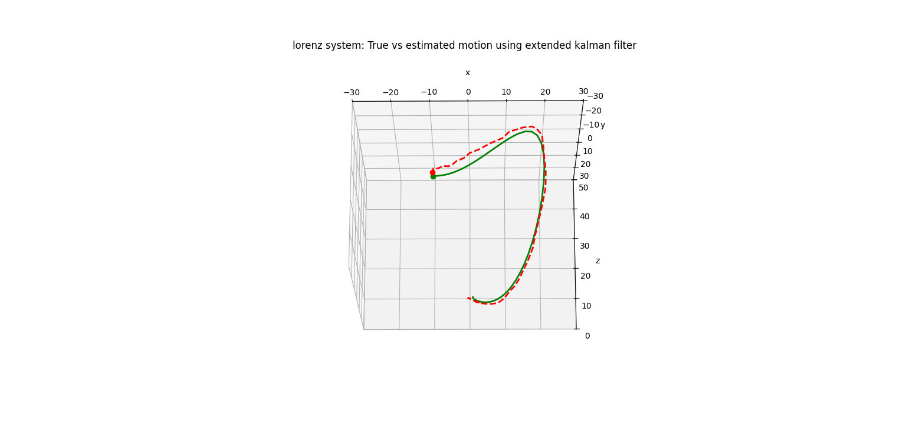

# Data Assimilation Techniques

This repository contains Python implementations of various data assimilation techniques, including Kalman Filtering, Extended Kalman Filtering, Particle Filtering, and Generalized Alpha-Beta Filtering. These methods are used for state estimation in dynamic systems, useful in fields like navigation, control systems, and time-series forecasting.

## Techniques

### Kalman Filtering
Kalman Filtering is an optimal estimator for linear dynamic systems with Gaussian noise. It is widely used in robotics, navigation, and tracking applications.

### Extended Kalman Filtering (EKF)
EKF is an extension of the Kalman filter for nonlinear systems. It linearizes the system using a first-order Taylor expansion and is commonly used in autonomous vehicles and aerospace engineering.

### Particle Filtering
Particle Filtering approximates the state distribution using a set of particles. It is effective for non-Gaussian noise models and is applied in areas like object tracking and financial modeling.

### Generalized Alpha-Beta Filtering
The Alpha-Beta filter is a simple, recursive estimator for linear systems that tracks position and velocity. It is used in radar and navigation for target tracking and prediction.

## Visualizations and Animations

### Lorentz Motion Prediction vs Actual
This animation compares the true states of the Lorentz system with the predicted states from Kalman Filtering.

### Kalman Filter Tracking of a Moving Target
This animation demonstrates how the Kalman Filter tracks a moving target over time, showing the predicted vs actual trajectory.

### Particle Filter Tracking
This animation illustrates the use of Particle Filtering to track an object in a noisy environment.

## Use Cases

- **Kalman Filter**: Ideal for applications in navigation and control, such as GPS or IMU-based positioning.
- **Extended Kalman Filter (EKF)**: Used for autonomous vehicles and systems with nonlinear dynamics.
- **Particle Filter**: Commonly applied in robot localization, object tracking, and filtering of non-Gaussian noise signals.
- **Alpha-Beta Filter**: Simple but effective in radar tracking, aircraft navigation, and other target tracking systems.

